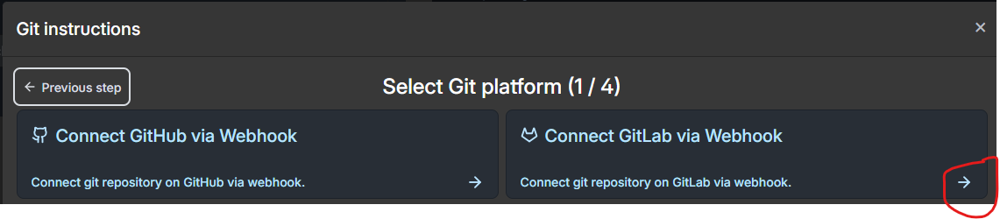
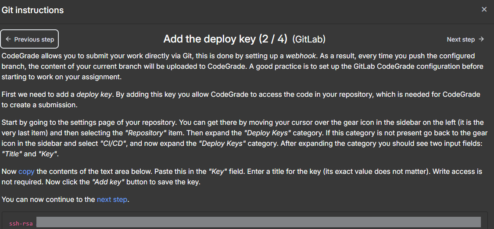
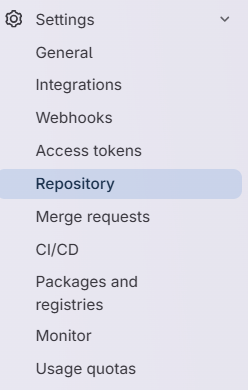
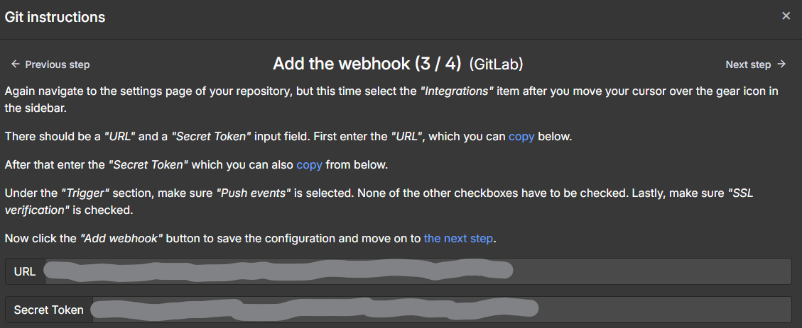
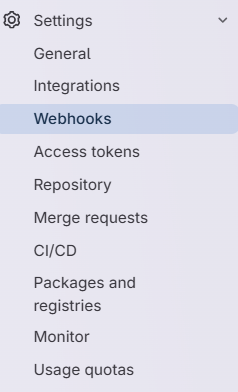
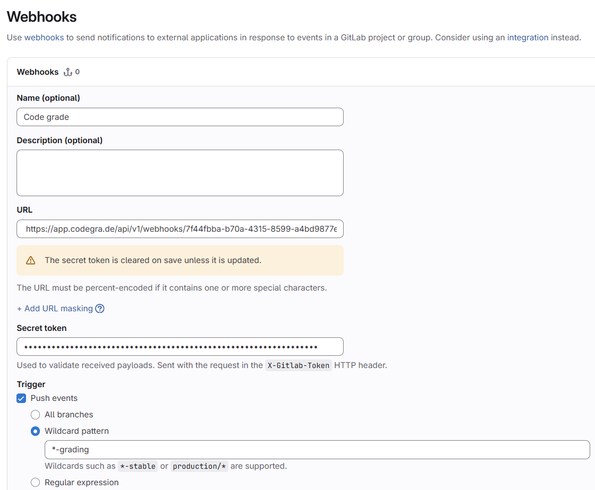
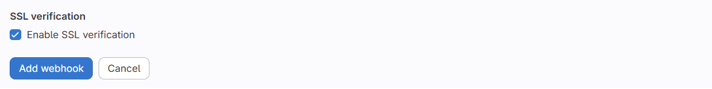
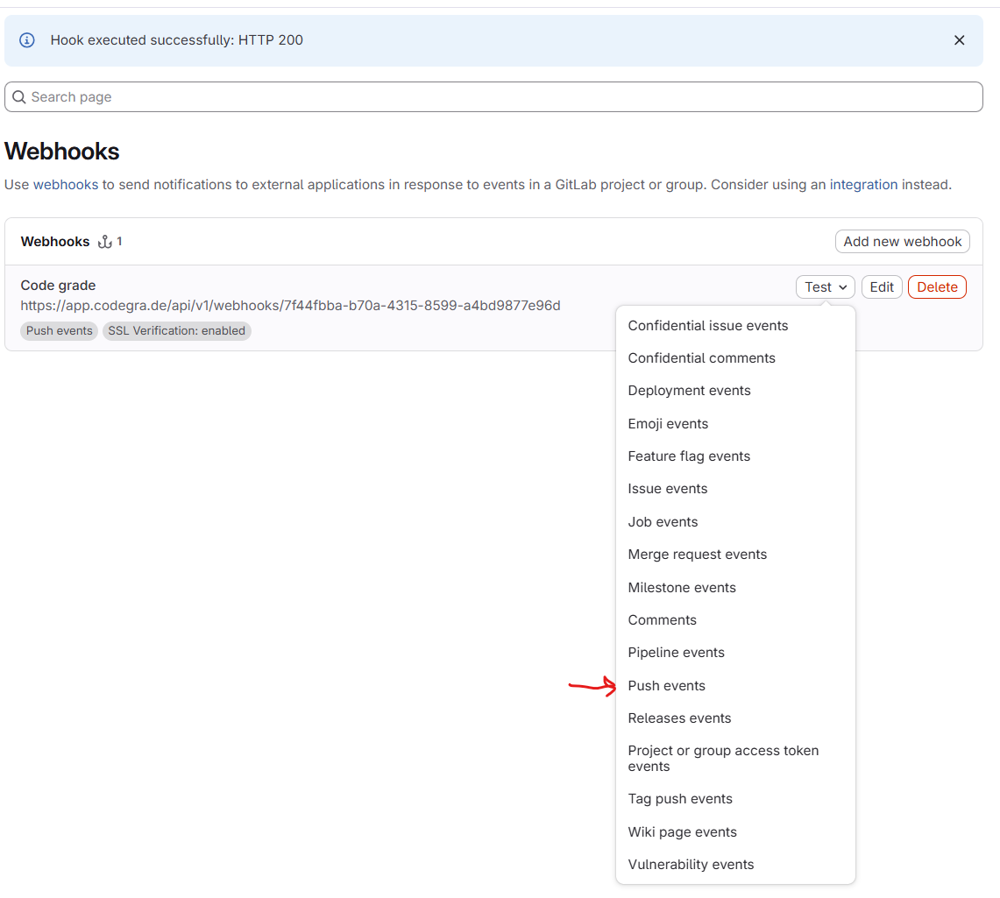
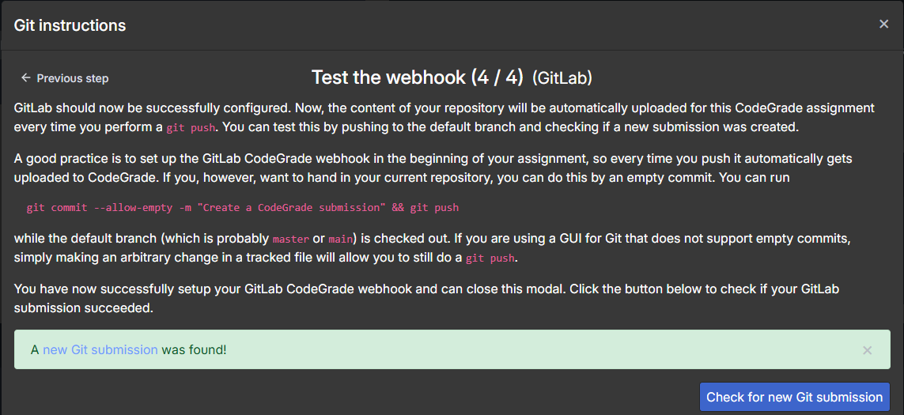

## Creating a connection with gitlab and code grade (Moodle)

1. Start connecting with gitlab

2. Add the deployment key to course-gitlab

Open "Settings" in your gitlab repository, select "Repository" and "Deploy keys". Select "Add new key" and store the given ssh-rsa - key to course-gitlab.

3. Add webhook to gitlab

Copy URL and token from code grade:

Create a new webhook in course-gitlab and save URL and token:

Select "Push events" and set wildcard to *-grading. Make sure "Enable SSL verification" is selected.

The web hook has been created now.

4. Test submission

You can test the hook by selecting "Test"->"Push events" in course-gitlab.

To see if test is ok also in code grade:

