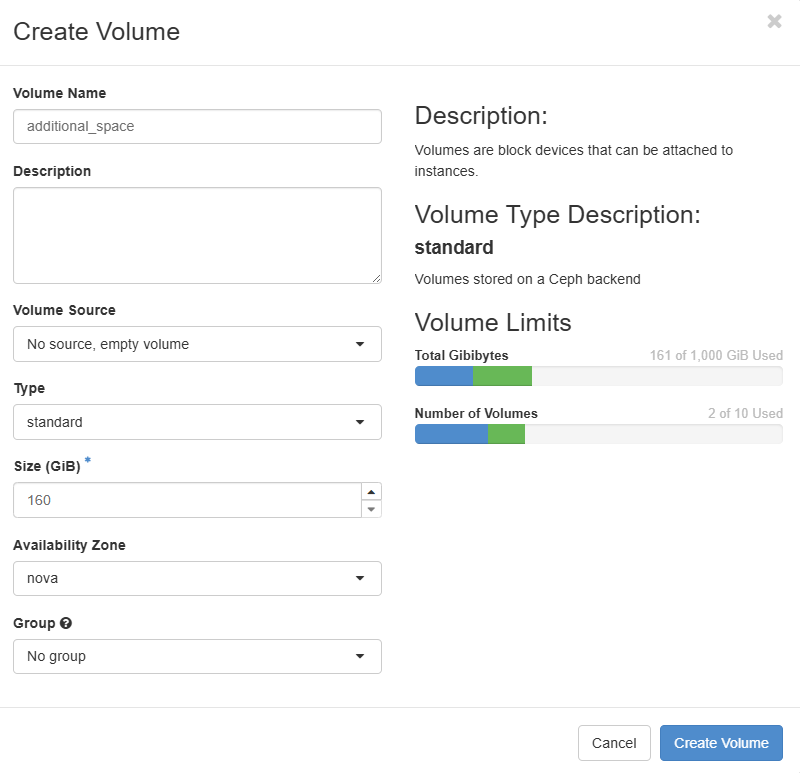
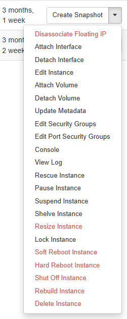
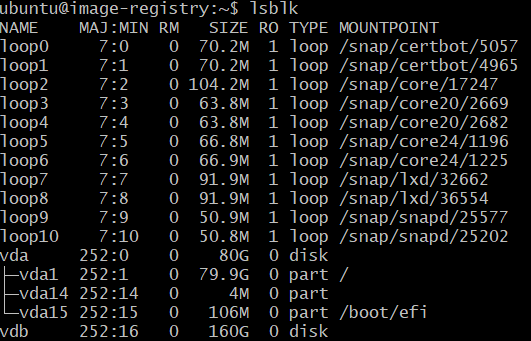
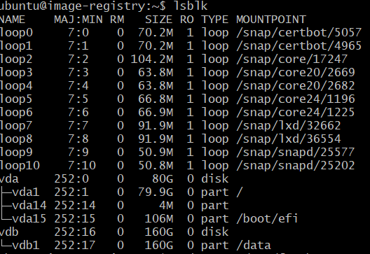

## Adding a new volume to a CSC virtual machine

If CSC virtual machine (running docker) runs out of disc space this is what can be done: add a new (bigger) volume and move the containers to use it as the persistent data storage.

1. Create a new volume in CSC

    

2. Select virtual machine for the new volume, select "Attach Volume"

    

3. Connect to virtual machine via ssh 

4. Stop docker containers that have volumes (docker compose down). 
    
    ```cmd
    sudo docker compose down
    ```

5. Check where the persistent data is stored (docker-compose.yml) and rename the folder /data_old. Create a new folder with the same name:

    ```cmd
    sudo mv /data /data_old
    sudo mkdir /data
    ```

6. Check the filesystem status 

    ```cmd
     df -h
    ```

7. Check that the new volume is visible (/dev/vdb) and doesn't have partitioning

    ```cmd
    lsbsk
    ```

     


8. Create disk partitions for device b (select defaults)

    ```cmd
    sudo fdisk /dev/vdb
    ```

9. Create an ext4 filesystem inside partition 1 on device b

    ```cmd
    sudo mkfs -t ext4 /dev/vdb1
    ```

10. Add the new disk to the configuration file

    ```cmd
    sudo nano /etc/fstab
    ```

    Write a new line (you can use other location than /data):
    ```cmd
    /dev/vdb1       /data   ext4    defaults        0 1
    ```

11. Mount the new disk

    ```cmd
     sudo mount -a
    ```

12. Check that the new volume is visible (/dev/vdb) and has partitioning

    ```cmd
    lsbsk
    ```

     

13. Copy all data to the new disk (might take long)

    ```cmd
    sudo cp -r /data_old /data
    ```

14. Set the owner and access rights for the files

    ```cmd
    cd /data_old

    sudo find . ! -type l -exec chown -v --reference='{}' /data/'{}' \;

    sudo find . ! -type l -exec chmod -v --reference='{}' /data/'{}' \;
    ```
15. Restart docker (docker-compose up -d)

    ```cmd
    sudo docker compose up -d
    ```


