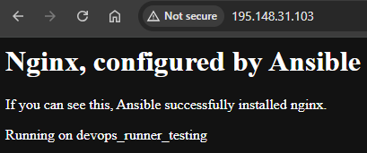

## Ansible

To read the book log in with Tuni-credentials: [Ansible: Up and Running, 3rd Edition](https://andor.tuni.fi/permalink/358FIN_TAMPO/1j3mh4m/alma9911780795505973).

### Installation

For learning ansible, open a new devcontainer (Ubuntu) in vscode. Python3 is installed as a default.

```cmd
    python3 --version
```

Install pip3, venv and Ansible:

```cmd
    sudo apt install python3-pip
    sudo apt install python3.12-venv
    python3 -m venv .venv --prompt A
    source .venv/bin/activate
    pip3 install ansible
```

- [Ansible: Up and Running, 3rd Edition: 2. Installation and setup](https://learning.oreilly.com/library/view/ansible-up-and/9781098109141/ch02.html#ansible_development)

### Connecting to a server 

Configure inventory/csc.ini file and test ssh-connection to your server:

```cmd
    unset DISPLAY
    ssh-keyscan -H your_host >> ~/.ssh/known_hosts
    ansible devops_runner_testing -i inventory/csc.ini -m ping
```

NOTE:
- set the file permissions for .ssh - folder and *.pem - file
    ```cmd
        chmod 700 .ssh
        chmod 600 ~/.ssh/yourkey.pem
    ```

- path to .ssh - folder needs to be absolute 
    ```cmd
        find / -name "yourkey.pem" 2>/dev/null
    ```

### Setup config

Place ansible.cfg file in the root of your project.

```cmd
    [defaults]
    inventory = inventory/csc.ini
    host_key_checking = False
    stdout_callback = default
    callback_result_format = yaml
    callback_enabled = timer
```

### Running ansible commands

Put longer commands in parenthesis:

```cmd
    ansible devops_runner_testing -a "tail /var/log/dmesg"
```

Get inventory:

```cmd
    ansible-inventory --graph
```

Install nginx (-b for root):

```cmd
    ansible devops_runner_testing -b -m package -a name=nginx
```

### Playbooks

Test playbooks by installing a webserver with one page,

In files/ create file "nginx.conf"

```cmd
server {
    listen 80 default_server;
    listen [::]:80 default_server ipv6only=on;

    root /usr/share/nginx/html;
    index index.html index.htm;

    server_name localhost;

    location / {
            try_files $uri $uri/ =404;
    }
}
```

In templates/ create "index.html.j2"

```cmd
    <html>
        <head>
            <title>Welcome to ansible</title>
        </head>
        <body>
            <h1>Nginx, configured by Ansible</h1>
            <p>If you can see this, Ansible successfully installed nginx.</p>

            <p>Running on {{ inventory_hostname }}</p>
        </body>
    </html>
```

Create playbook-file "webservers.yml"

```cmd
    ---
    - name: Configure webserver with nginx
    hosts: webservers
    become: true
    tasks:
        - name: Ensure nginx is installed
        package:
            name: nginx
            update_cache: true

        - name: Copy nginx config file
        copy:
            src: nginx.conf
            dest: /etc/nginx/sites-available/default

        - name: Enable configuration
        file:
            src: /etc/nginx/sites-available/default
            dest: /etc/nginx/sites-enabled/default
            state: link

        - name: Copy home page template
        template:
            src: index.html.j2
            dest: /usr/share/nginx/html/index.html

        - name: Restart nginx
        service:
            name: nginx
            state: restarted
    ...
```

Run your playbook:

```cmd
    ansible-playbook webservers.yml
```

This should be visible in you IP-address:

    

- [Ansible: Up and Running, 3rd Edition: 2. Playbooks](https://learning.oreilly.com/library/view/ansible-up-and/9781098109141/ch03.html#specifying_an_nginx_config_file)

### Certificate for nginx using Let's encrypt

Create new playbook "certbot.yml".

```cmd
    ---
    - name: Setup Nginx SSL with Let's Encrypt
    hosts: webservers
    become: true
    vars:
        email: "your@email.com"
        domain: "your.domain.com"
    tasks:
        - name: Install Certbot and Nginx plugin
        apt:
            name: [certbot, python3-certbot-nginx]
            state: present
        - name: Run Certbot for Nginx
        command: "certbot --nginx -d {{ domain }} --email {{ email }} --agree-tos -n"
    ...
```

### Install Docker and docker-compose

```cmd
    ---
    - name: Install Docker on Ubuntu using official Docker repo
    hosts: all
    become: true

    tasks:
        - name: Update apt cache
        ansible.builtin.apt:
            update_cache: yes

        - name: Ensure dependencies are installed
        ansible.builtin.package:
            name:
            - bc
            - curl
            - expect
            - git
            - ca-certificates
            state: present

        - name: Create Docker GPG key directory
        ansible.builtin.file:
            path: /etc/apt/keyrings
            state: directory
            mode: "0755"

        - name: Download Docker's official GPG key
        ansible.builtin.get_url:
            url: https://download.docker.com/linux/ubuntu/gpg
            dest: /etc/apt/keyrings/docker.asc
            mode: "0644"

        - name: Add Docker repository to Apt sources
        ansible.builtin.apt_repository:
            repo: "deb [arch=amd64 signed-by=/etc/apt/keyrings/docker.asc] https://download.docker.com/linux/ubuntu  {{ ansible_facts['distribution_release'] }} stable"
            state: present
            filename: docker

        - name: Update apt cache after adding Docker repository
        ansible.builtin.apt:
            update_cache: yes

        - name: Install Docker and Docker Compose
        ansible.builtin.package:
            name:
            - docker-ce
            - docker-ce-cli
            - containerd.io
            - docker-buildx-plugin
            - docker-compose-plugin
            state: present

        - name: Ensure Docker service is enabled and started
        ansible.builtin.service:
            name: docker
            state: started
            enabled: yes

        - name: Add ubuntu user to docker group
        ansible.builtin.user:
            name: ubuntu
            groups: docker
            append: yes
``` 

    - [Install Docker with Ansible on Ubuntu (Official Repo + Docker Compose)](https://dev.to/lovestaco/install-docker-with-ansible-on-ubuntu-official-repo-docker-compose-578b)

### Install gitlab runner using roles 

Create playbook "gitlab_runner.yml"

```cmd
  - hosts: all
    become: true
    vars_files:
        - vars/main.yml
    roles:
        - { role: riemers.gitlab-runner }
```    

Create vars/mail.yml

```cmd
    gitlab_runner_coordinator_url: https://your-gitlab-url/
    gitlab_runner_registration_token: 'your_token_from_gitlab'
    gitlab_runner_runners:
  - name: 'Example Docker GitLab Runner'
    executor: docker
    docker_image: 'alpine'
    docker_volumes:
      - "/var/run/docker.sock:/var/run/docker.sock"
      - "/cache"
    extra_configs:
      runners.docker:
        memory: 512m
      runners.docker.sysctls:
        net.ipv4.ip_forward: "1"
```

Install role and run playbook:

```cmd
    ansible-galaxy install riemers.gitlab-runner
    ansible-playbook gitlab_runner.yml
```

    - [https://github.com/riemers/ansible-gitlab-runner](https://github.com/riemers/ansible-gitlab-runner)
    - [Ansible Roles: Basics, Creating & Using](https://spacelift.io/blog/ansible-roles)


