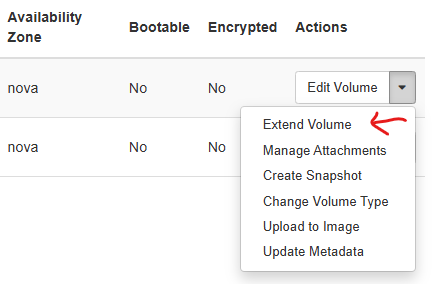

## Extending a volume in CSC virtual machine

If CSC virtual machine using a volume runs out of disc space this is what can be done: extend volume and confire Ubuntu to use it.

1. Connect to virtual machine via ssh and stop containers that are using the volume

    ```cmd
    sudo docker compose down
    ```

2. Extend volume size in CSC control panel

    

3.  Restart VM from CSC control panel

4. Now the disk size should be bigger

    ```cmd
    sudo lsblk
    ```

5. Unmount the disk

    ```cmd
    sudo umount /data
    ```

6. Install parted (if not already installed)

    ```cmd
    sudo apt update
    sudo apt install gparted
    ```

7. Run parted

    ```cmd
    sudo parted /dev/vdb
    ```

    In interactive terminal see the number of the partitioning to be extended:

    ```cmd
    (parted) help
    (parted) print
    ```

    Extend partition 1 to 100%:

    ```cmd
    (parted) resizepart 1 100%
    (parted) quit
    ```

8. Apply to the file system, run:

    ```cmd
    sudo e2fsck -f /dev/vdb1
    sudo resize2fs /dev/vdb1
    ```

9. Remount the disk

    ```cmd
    sudo mount -a
    ```

10. Check that disk and space ok

    ```cmd
    df -f
    ```
    
11. Restart containers

    ```cmd
    sudo docker compose up -d
    ```