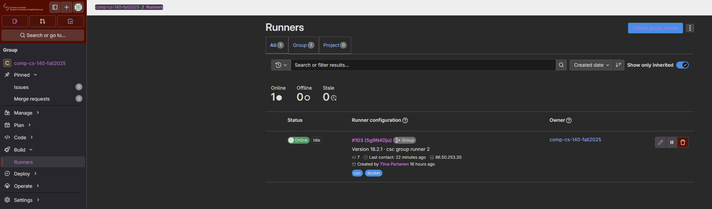
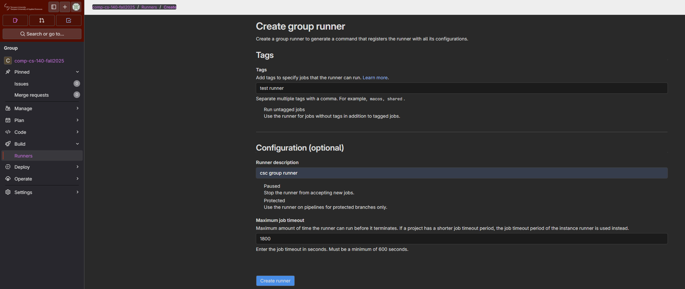
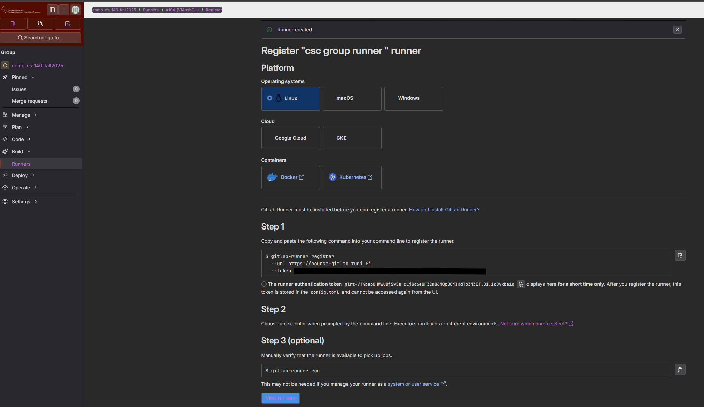
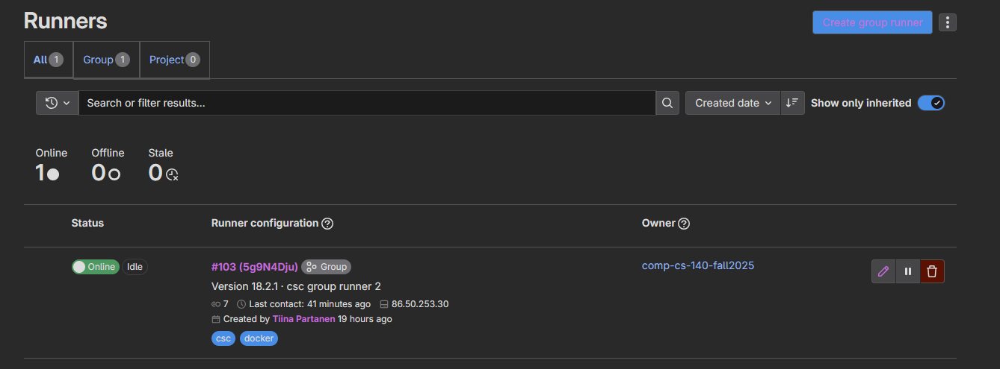
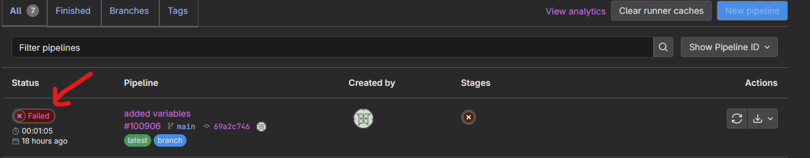
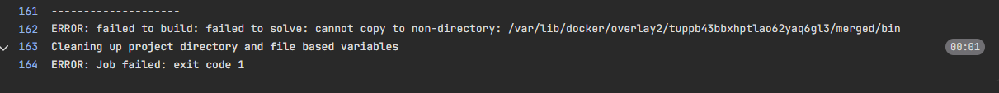
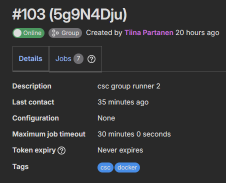
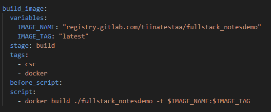

## Gitlab runner

Gitlab runner runs the CI/CD tasks that are configured in *gitlab-ci.yaml*-file located in the root of the code repository. Selfhosted Gitlab doesn't necessessary have runners available out-of-the-box. One needs to install them themselves. 

First you need to install gitlab-runner either in your desktop (in docker) or in a server (linux). Server would be only feasible solution for a group usage.

### Server (cloud) installation for a group-runner 

1. Allocate a new virtual machine from your cloud provider (ubuntu 22.04)
2. Configure security group to allow port 22 (ingress) from your IP address
3. Connect to the server via SSH
4. Install Docker [instructions](https://docs.docker.com/engine/install/ubuntu/)
5. Install Gitlab-runner [instructions](https://docs.gitlab.com/runner/install/linux-repository/).
6. Register Gitlab-runner to your Gitlab-instance [instructions](https://docs.gitlab.com/runner/register/). 
    - Get a ready-made register command from your Gitlab-page (you need to have Owner rights for the group). From the group main page, select Runners -> Create group runner:
    
    
    
    - Run the register command in you server (use sudo). When prompted for: 
        - Executor (select: Docker), [read more](https://docs.gitlab.com/runner/executors/docker/)
        - Default image (select: ubuntu:latest) 
7. Start the runner and check its status
    ```cmd
    sudo systemctl start gitlab-runner
    sudo systemctl status gitlab-runner
    ```
8. Now you should have a group-runner visible in Gitlab
    

### Docker-in-docker

1. Add *docker* - image and *docker:dind* - service to you CI/CD - container. This enables your container to run docker daemon inside your container and let's it talk to the docker daemon via *unix socket*. Add to your *gitlab-ci.yaml*-file:

    ```yaml
    image: docker:latest

    variables:
        DOCKER_HOST: "unix:///runner/services/docker/docker.sock"

    services:
        - docker:dind
    ```
2. Configure the *unix socket* also in the docker executor's side and restart the service. 
    - Edit *config.toml* in the server:
        ```cmd
        sudo nano /etc/gitlab-runner/config.toml
        ```
    - Set docker-runner to run as *priviledged* and open *unix socket* by mounting its address as a volume:
    ```toml
    ...
    [[runners]]
    ...
      [runners.docker]
        ...
         privileged = true
         volumes = ["/cache", "/runner/services/docker"]
        ...
    ```   
    - Restart gitlab-runner
    ```cmd
    sudo gitlab-runner restart
    ```
---
## If it still doesn't work...

- Restart runner, re-register runner, etc.

- See gitlab-runners log

    ```cmd
    sudo journalctl -u gitlab-runner
    ```
- See the Gitlab-log for failed build, select your repository -> Build -> Pipelines and open failed build to see the log (click "Failed" and "x" icons)
    
    
    

- Check that the tags in your *gitlab-ci.yaml*-file match with those of your runner:

    
    
