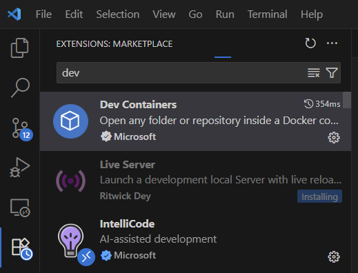
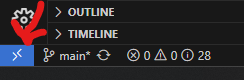
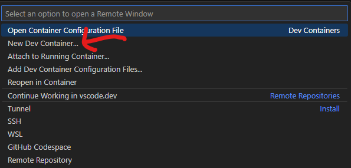
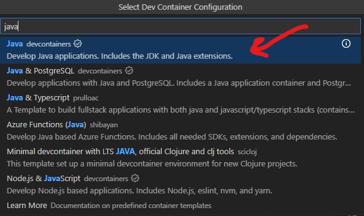
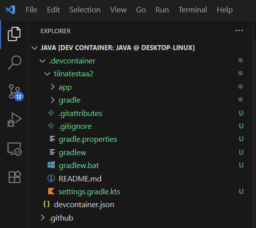

## Setting up Java development environment

These instructions are tested using Visual Studio Code in Windows.

1.	Install dev containers plug-in for VS

    

2.	Create a new dev container in VSCode, first open devcontainer menu (see down left corner):

     

     Select create new container, select "Java" 

     

     

3. Install Gradle [see](https://docs.gradle.org/current/userguide/installation.html)

    ```cmd
    sdk install gradle
    ```

4. Create a Java-application project template with gradle [see](https://docs.gradle.org/current/userguide/part1_gradle_init.html):

    ```cmd
    $ gradle init --type java-application  --dsl kotlin
    ```

    This is what you get:
     


